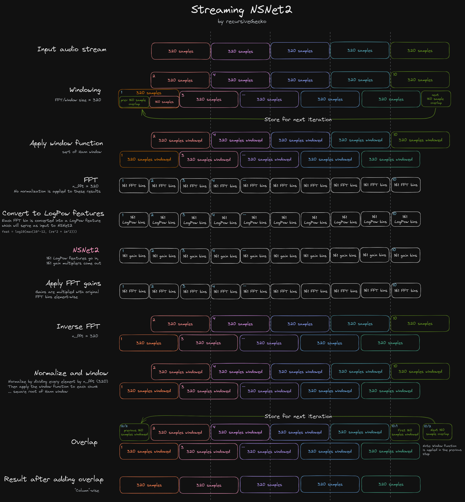

# NSNet2

Zig implementation of the baseline noise suppressor in the Microsoft DNS challenge:

https://github.com/microsoft/DNS-Challenge/tree/v4dnschallenge_ICASSP2022/NSNet2-baseline

# Output

Sample clips and their outputs can be found in `data/`.

# Caveats

From my limited understanding it seems like NSNet2 doesn't provide a way to save its internal hidden
state between inference runs. The model has a single input, a matrix that contains features calculated
for a list of audio frames of arbitrary length, and produces a single output, with corresponding gain
values for each FFT feature/bin.

This indicates that the internal model state is lost between inference runs, which causes audible audio
artifacts which can be heard in the sample clips contained in the `data/` directory.

Original Python implementation doesn't suffer from this issue because it feeds the entire audio file 
into the model in a single inference run, but since this example is meant to be used for streaming
audio, that's not an option.

The frequency of these artifacts can be reduced by increasing the `chunk_size` which comes with a 
trade-off of higher latency.

This model could potentially be modified so that it outputs its hidden state and accepts the previous
state as an input, but unfortunately this is currently outside my skill set. **PRs/contributions welcome!**

# Diagram

